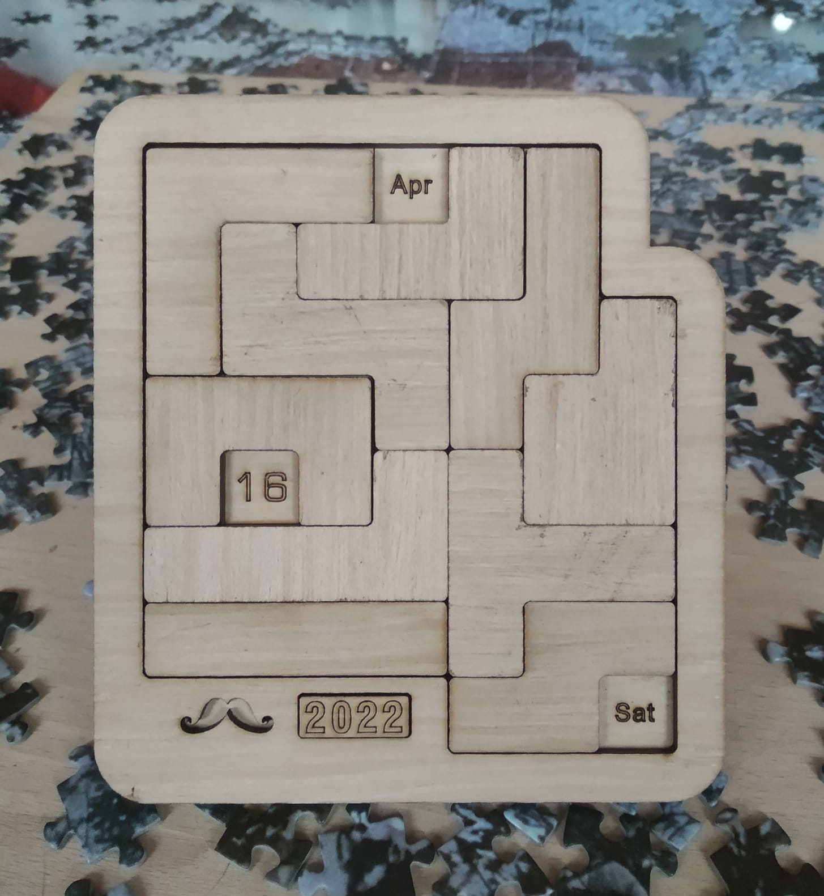

# CalendarPuzzle
This has code to analyze and solve a calendar puzzle.

This puzzle offers challenges for all 366 valid dates and each weekday for a total of 2562 individual challenges.

Starting on January 1st 2022 there is a new puzzle for 2191 consecutive days up to and including December 31st 2027. 
The year 2028 starts on a Saturday just like 2022, but because it is a leap year there are only 31+29=59 puzzles repeated until
there is a fresh one on February 29th 2028. 

Then it repeats again through to a new challenge on March 1st 2029. There follow 306 new challenges in 2029 and 59 new ones in 2030 
where we will have seen everything from March 1st on.

The five remaining new challenges appear on the leap days in 2032, 2036, 2040, 2044 and 2048.

From January 1st 2049 on the cycle repeats. But Facebook will propably have forgotten the solutions by then.

# Solver1.py

Solver.py is a recursive-descent solver patterned after my solver for FridgeIQ. Written in Python it uses Shapely and Descartes
to model the board and pieces and to detect overlaps.

The solver core can solve for a given combination of month, day and weekday. 

To do that it models the board by covering the three target squares and then attempts to place all the pieces in the remaining area.

If successful it saves the result as a JSON data file and a PNG image.

There also is a loop that iterates over each day in the date range the puzzle is interesting and solves for each combination.

# Solver2.py

This is a variant of the solver that just places all the pieces and checks the result for wether it is a valid solution.

Valid solutions are those where the three remaining uncovered squares are exactly one month, one day and one weekday each.

# Solver3.py

This variant uses the logic of Solver.py. It removes the dependency on Shapely and Descartes and models the board and pieces
as 2D-array with combinations of None and boolean values.

# Render.py

This program reads the JSON data files any solver generates and renders a pretty picture of the calendar for each day.

